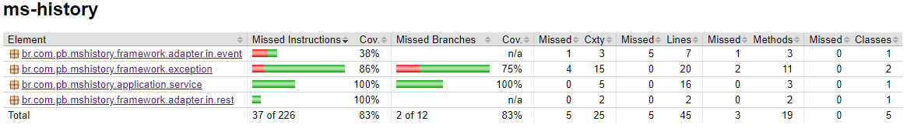

# MS History

- URL: http://localhost:8082/api
- [Swagger - OpenAPI](https://github.com/theodoroferreira/avaliacao-individual/ms-history/src/main/resources/openapi.yaml)
- MongoDB




## Exemplo de cURL

### GET - Listar Pedidos

`/orders`

```cURL
curl --location --request GET 'http://localhost:8081/api/orders?cpf=06069043952&sort=totalValue,desc'
```
